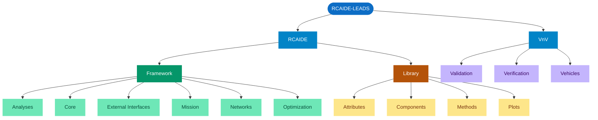
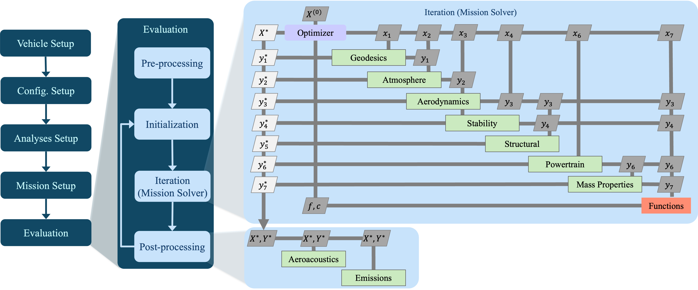
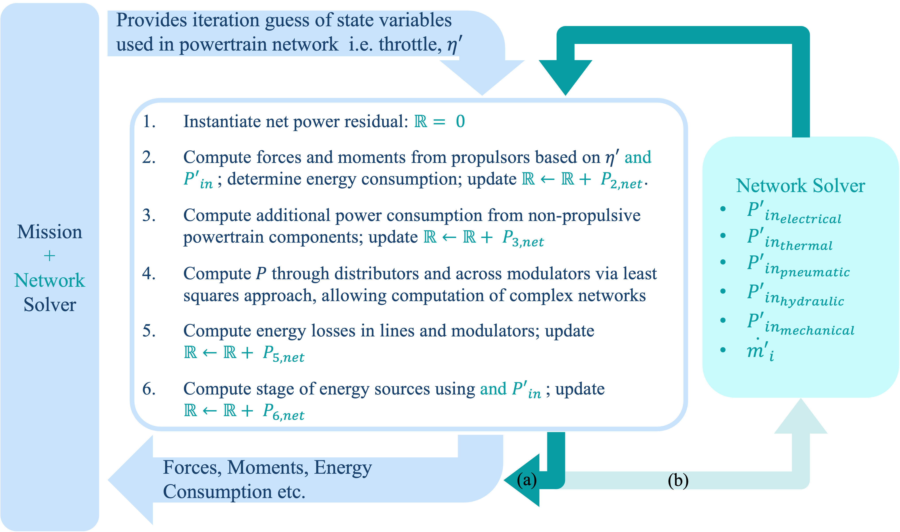
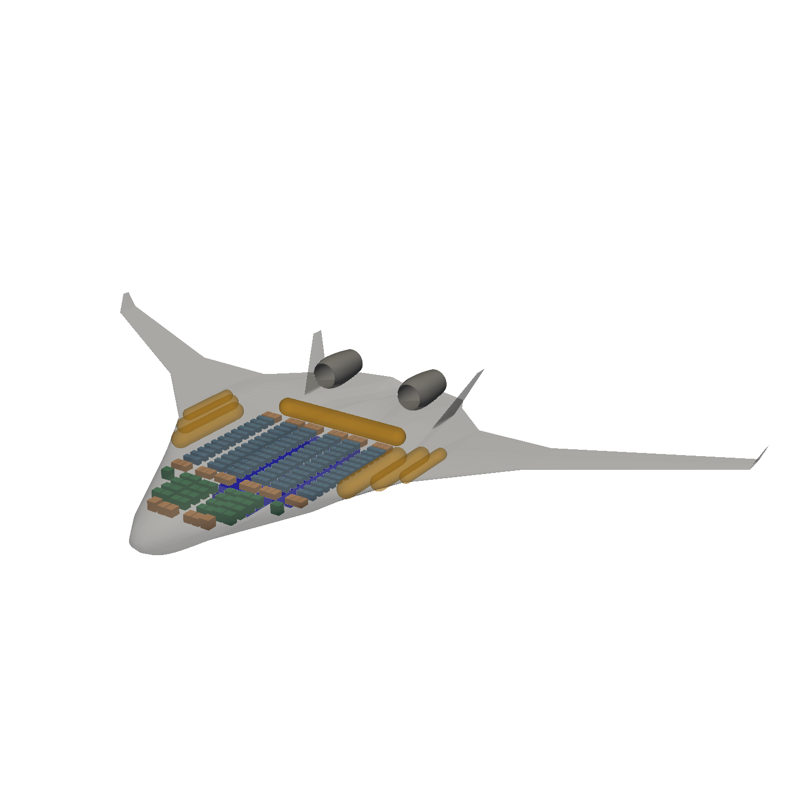
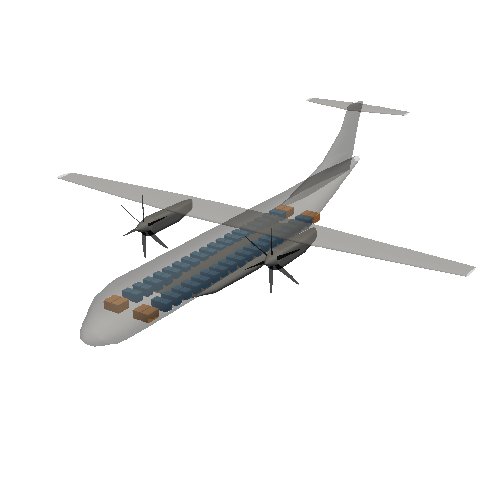
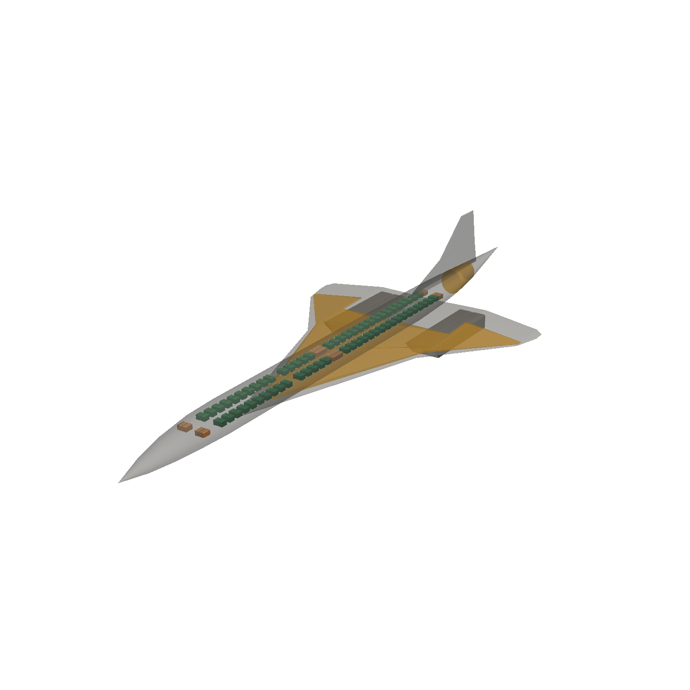
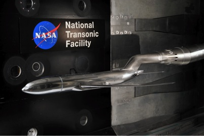
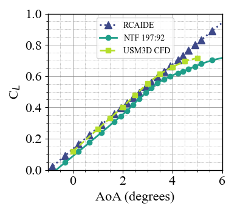
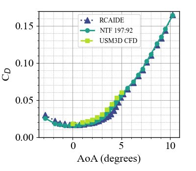
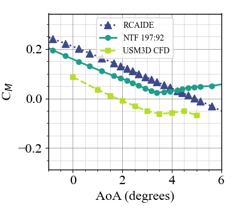

<p align="center">
  
</p>

<p align="center">
  <a href="https://aerospace.illinois.edu">
    
  </a>
  &nbsp;&nbsp;&nbsp;&nbsp;&nbsp;&nbsp;
  <a href="https://www.leadsresearchgroup.com">
    
  </a>
</p>

<p align="center">
  Developed at the <strong>University of Illinois Urbana-Champaign</strong><br>
  <a href="https://www.leadsresearchgroup.com"><strong>Laboratory for Emerging Aircraft Design and Systems (LEADS)</strong></a>
</p>

<div align="center">

[](https://github.com/leadsgroup/RCAIDE_LEADS/actions/workflows/CI.yml)
[](https://github.com/leadsgroup/RCAIDE_LEADS/actions/workflows/sphinx_docs.yml)
[](https://codecov.io/gh/leadsgroup/RCAIDE_LEADS)
[](https://pepy.tech/projects/rcaide-leads)

</div>

---

# RCAIDE: Research Community Aerospace Interdisciplinary Design Environment

The Research Community Aerospace Interdisciplinary Design Environment, or RCAIDE (pronounced "arcade"), is a powerful open-source Python platform for aircraft design and analysis. From commercial airliners to UAVs and next-generation hybrid-electric aircraft, RCAIDE provides comprehensive multi-disciplinary analysis tools backed by validated engineering methods. Its streamlined workflow and modular architecture help aerospace engineers and researchers accelerate development cycles and explore innovative designs with confidence. RCAIDE-LEADS is a GitHub fork of RCAIDE, developed and maintained by the [Laboratory for Emerging Aircraft Design and Systems (LEADS)](https://www.leadsresearchgroup.com/) at the [University of Illinois Urbana-Champaign](https://aerospace.illinois.edu).

## Table of Contents
- [Citing RCAIDE](#citing-rcaide)
- [Userbase](#userbase)
- [Code Architecture](#code-architecture)
- [Computational Workflow](#computational-workflow)
- [Powertrain Network Solver](#powertrain-network-solver)
- [Capabilities](#capabilities-of-rcaide)
- [Validation](#validation)
- [External Interfaces](#external-interfaces)
- [Installing RCAIDE](#installing-rcaide)
- [Tutorials](#tutorials)
- [Contributing](#contributing-to-rcaide)
- [Roadmap](#roadmap)
- [Get in Touch](#get-in-touch)

## Citing RCAIDE

If you use RCAIDE in your research, please cite:

> Clarke, Matthew A., et al. "RCAIDE: A Multidisciplinary Analysis Toolbox for Aircraft Design and Flight Simulation." *Aerospace Science and Technology* (2026): 112328.

```bibtex
@article{clarke2026rcaide,
  title   = {RCAIDE: A Multidisciplinary Analysis Toolbox for Aircraft Design and Flight Simulation},
  author  = {Clarke, Matthew A. and others},
  journal = {Aerospace Science and Technology},
  pages   = {112328},
  year    = {2026}
}
```

## Userbase
RCAIDE has seen widespread adoption across industry, government, and academia, providing validated and verified results to communities worldwide. Notable users include:
* **Industry and Government:** NASA, Boeing, AFRL, Embraer, Joby, Vahana, Argonne National Labs, Bombardier, Raytheon, BAE, Google
* **Academia:** MIT, Purdue, Embry Riddle, Carnegie Mellon, Princeton, Virginia Tech, Georgia Tech, Michigan, Stanford University, Cranfield University, University of Sydney, TU Delft, IIT, University of Toronto, Concordia University, ISAE

<p align="center">
  <a href="https://pepy.tech/projects/rcaide-leads">
    
  </a>
  &nbsp;&nbsp;
  <a href="https://pepy.tech/projects/rcaide-leads">
    
  </a>
</p>

<p align="center">
  <a href="https://pepy.tech/projects/rcaide-leads">View live download statistics →</a>
</p>

## Code Architecture

RCAIDE is a pure-Python framework built around two principles: **separation of physics from numerics** and **declarative vehicle specification**. The source package is divided into a `Framework` — which owns the simulation engine, mission solver, and energy networks — and a `Library` — which owns the physical world: component geometries, material attributes, and discipline methods. Adding a new propulsion architecture or analysis method requires only Library changes; the Framework solver operates on it automatically.



**`Framework`** — the simulation engine. `Core` provides the base data container and unit system. `Mission` and `Networks` implement the coupled ODE and closed-loop energy solvers. `Analyses` manages fidelity-swappable discipline modules. `Optimization` wraps gradient-based and gradient-free drivers. `External_Interfaces` connects to OpenVSP and AVL.

**`Library`** — the physical world. `Components` are declarative Python objects (wings, fuselages, motors, batteries) that compose the `Vehicle`. `Attributes` stores material and propellant properties. `Methods` implements all discipline analyses, organised across 14 subdisciplines:

| Domain | Subdirectories |
|---|---|
| Aerodynamics | `Aerodynamics`, `Aerostructures`, `Stability` |
| Propulsion & Energy | `Powertrain`, `Gas_Dynamics`, `Thermal_Management` |
| Acoustics | `Aeroacoustics`, `Noise` |
| Geometry & Mass | `Geometry`, `Geodesics`, `Mass_Properties` |
| Vehicle Performance | `Performance`, `Emissions` |
| Utilities | `Utilities` |

**`VnV`** — the test suite. `Verification` contains unit and integration tests for numerical correctness. `Validation` contains regression tests against experimental and reference data. `Vehicles` provides the reference vehicle configurations used across both suites.

## Computational Workflow

Aircraft conceptualization within RCAIDE begins with instantiation of the `Vehicle()` Python class, which acts as a hierarchical container for all geometric, mass, and propulsion properties. The simulation process follows five steps, illustrated in the figure below:

<p align="center">
  
</p>

1. **Vehicle Setup** — Specifies core parameters including geometry, propulsion architecture, and mass properties.
2. **Configuration Setup** — Defines the various aircraft configurations used throughout the mission (e.g., takeoff with flaps deflected, cruise, descent with spoilers deployed).
3. **Analyses Setup** — Specifies the multidisciplinary analyses to be evaluated during flight simulation, including aerodynamics, stability, acoustics, and emissions.
4. **Mission Setup** — Outlines the flight kinematics for each segment and specifies operating conditions. RCAIDE currently supports more than 30 predefined flight maneuvers categorized as climb, descent, cruise, single-point, ground, vertical flight, or untrimmed.
5. **Mission Evaluation** — Executed automatically in four sub-routines: (1) *preprocessing*, where user inputs are checked for consistency; (2) *initialization*, where inputs are assembled into matrices; (3) *iteration*, where the mission solver constructs and recursively solves force and moment balance equations; and (4) *post-processing*, where converged state variables feed decoupled analyses such as noise and emissions.

## Powertrain Network Solver

A key innovation in RCAIDE is its closed-loop powertrain network architecture. Unlike conventional aircraft synthesis tools that use open-loop methods — ignoring losses from secondary components such as pumps, heat exchangers, and cryogenic tanks — RCAIDE enforces energy closure across all powertrain domains (electrical, thermal, mechanical, pneumatic, and hydraulic).

<p align="center">
  
</p>

At each mission solver iteration, the network solver:

1. Computes forces and moments from propulsors based on the throttle state η′ and determines energy consumption.
2. Computes additional power drawn by non-propulsive components (pumps, APUs, avionics, etc.).
3. Computes energy flow through distributors (fuel lines, electrical buses, coolant lines).
4. Resolves P across modulators via a least-squares approach, enabling analysis of complex multi-source architectures.
5. Computes energy losses in lines and modulators and updates the net power residual.
6. Computes the state of energy sources (fuel tank mass, battery state of charge, thermal effects) and updates the residual.

The net power residual is returned to either the mission solver (path a, simpler architectures) or a decoupled nested optimizer (path b, complex or cryogenic systems). This approach guarantees thermodynamic closure and eliminates the design flaws that arise from open-loop powertrain assumptions.

## Capabilities of RCAIDE
RCAIDE currently possesses the ability to perform various analyses at multiple fidelity levels. Higher fidelity provides greater accuracy but requires more computational resources. The multi-fidelity capability enables:

### Aircraft Design & Analysis
* **Geometry**
  * Advanced parameterization
  * 3D visualization — click any model below to open an interactive viewer

  <table align="center">
    <tr>
      <td align="center" width="33%">
        <br/>
        <b>Hydrogen BWB</b>
      </td>
      <td align="center" width="33%">
        <br/>
        <b>ATR 72 All-Electric</b>
      </td>
      <td align="center" width="33%">
        <br/>
        <b>Concorde</b>
      </td>
    </tr>
  </table>

* **Mission Analysis**
  * Complete flight vehicle simulation
  * Energy network analysis
  * Design space exploration

* **Performance Analysis**
  * Payload range studies
  * Aerodynamic characteristics
  * V-N diagrams
  * Propeller performance
  * Takeoff field length estimation

* **Weights & Balance**
  * Operating empty weight estimation
  * Component-level weight breakdown
  * Center of gravity analysis
  * Moment of inertia calculations

### Advanced Capabilities
* **Optimization**
  * Gradient-based methods
  * Non-gradient algorithms
  * Multi-fidelity approaches
* **Artificial Intelligence Integration**
* **Model-Based Systems Engineering**

## Validation

RCAIDE's methods are validated against experimental data and high-fidelity simulations across all major disciplines. The Twisted NASA Common Research Model (CRM) — tested at the NASA Langley National Transonic Facility (NTF) — serves as the primary aerodynamic benchmark.

<p align="center">
  
</p>

Lift, drag, and pitching moment coefficients predicted by RCAIDE's Vortex Lattice Method (VLM) and semi-empirical drag buildup are compared below against experimental NTF data and USM3D CFD results at M∞ = 0.85:

<p align="center">
  
  &nbsp;
  
  &nbsp;
  
</p>

RCAIDE achieves R² = 0.96 for lift and R² = 0.94 for drag against experimental measurements, demonstrating accuracy comparable to high-fidelity CFD at a fraction of the computational cost. Validation spanning weights, stability derivatives, propulsion components, and emissions is documented in the [RCAIDE paper](https://doi.org/10.1016/j.ast.2026.112328) and in the [Verification & Validation subdirectory](VnV/).

## External Interfaces
RCAIDE currently supports two external packages, OpenVSP and AVL. Regarding the former, users can automatically generate OpenVSP geometry from RCAIDE and even read in geometry to perform mission simulations. RCAIDE's AVL interface enables the automatic generation of AVL files in addition to running AVL directly through the built-in Python API. This allows designers to focus on design and analysis rather than file management. The development team is actively working on a SU2 interface for high-fidelity CFD.

<p align="center">
  
</p>

## Installing RCAIDE
RCAIDE is available on GNU/Linux, MacOS, and Windows. We strongly recommend installing RCAIDE within a Python virtual environment to avoid conflicts with existing Python installations.

* [See Installation Instructions](https://www.docs.rcaide.leadsresearchgroup.com/install.html)
* Using pip: `pip install RCAIDE-LEADS`
* Using conda: coming soon

## Tutorials
[See Tutorials here](https://docs.rcaide.leadsresearchgroup.com/tutorials.html)

## Contributing to RCAIDE

**Contributing Institutions**
* [University of Illinois Urbana-Champaign — Laboratory for Emerging Aircraft Design and Systems (LEADS)](https://www.leadsresearchgroup.com/)

RCAIDE is the primary open-source tool of the LEADS group, led by Prof. Matthew Clarke in the Department of Aerospace Engineering at the University of Illinois Urbana-Champaign. The group focuses on the design, analysis, and optimization of emerging aircraft concepts including hybrid-electric, fully electric, and hydrogen-powered vehicles.

**Getting Involved**

If you'd like to help develop RCAIDE by adding new methods, writing documentation, or fixing bugs, please read the [contributing guidelines](https://www.docs.rcaide.leadsresearchgroup.com/contributing.html) first.

Submit improvements or new features via a [pull request](https://github.com/leadsgroup/RCAIDE_LEADS/pulls).

## Roadmap

The following capabilities are planned for future RCAIDE releases, organized by development area.

### Solver & Numerical Methods

- [ ] **Just-in-Time Compilation and Automatic Differentiation** — Integration of JIT-compiled numerical backends (e.g., JAX) to provide exact analytic gradients across all solvers and optimizers, accelerating convergence and enabling substantially larger gradient-based design optimization problems
- [ ] **Static Type Checking and RNumpy Integration** — Adoption of static type annotations throughout the codebase and integration of RNumpy-style array shape validation to improve code robustness, catch shape mismatches at development time, and support IDE-assisted development
- [ ] **Time-Marching Solver** — An ODE-based numerical integration option for problems requiring continuous-state propagation, enabling flight controller logic design and hardware subsystem co-simulation

### Aerodynamics, Structures & Rotorcraft

- [ ] **Control Surface Generalization** — A fully generic control surface parameterization framework supporting arbitrary surface topologies, deflection kinematics, and coupled aerodynamic interactions beyond the current conventional configurations
- [ ] **Aerostructural Coupling and Aeroelasticity** — High-fidelity coupled aerodynamic and structural analysis for flexible wings, enabling load distribution, static aeroelastic deformation, and flutter prediction for unconventional configurations
- [ ] **Rotorcraft Modeling and Aero-Propulsive Coupling** — Extended rotor aerodynamics including hover performance, blade-vortex interaction, and wake-induced aero-propulsive coupling for rotary-wing and tilt-rotor configurations

### Propulsion & Vehicle Systems

- [ ] **Energy-Agnostic Network Refactor** — A generalized powertrain network architecture that further decouples energy domain definitions from propulsor topologies, enabling arbitrary source–converter–propulsor couplings including novel and not-yet-classified architectures
- [ ] **Electrochemical Battery Models** — Physics-based electrochemical and thermal battery models capturing state-of-health evolution, internal resistance dynamics, and thermal runaway behavior beyond current chemistry-based lookup tables
- [ ] **3D SPI2 Integration** — Integration of the Spatial Packaging of Interconnected Systems with Physical Interactions (SPI2) framework for three-dimensional vehicle-level systems layout, enabling geometry-aware routing of fuel lines, coolant lines, and electrical buses and their associated weight and drag penalties

### Vehicle-Level Analysis

- [ ] **6-DOF eVTOL Trimming** — Improved sparse matrix handling and solver robustness for multi-rotor trim problems where each rotor may have independent RPM, thrust-vectoring angles, and blade pitch settings
- [ ] **Reliability & Fault Probability Estimation** — Quantitative methods for component-level reliability analysis and fault tree evaluation, supporting design for safety and certification planning for novel aircraft concepts

### Artificial Intelligence & Design Automation

- [ ] **Machine Learning and Generative AI Integration** — Native surrogate model construction from mission simulation data, generative design workflows for aircraft conceptualization, and LLM-assisted configuration setup and post-processing interpretation

### External Interfaces

- [ ] **High-Fidelity CFD Integration** — Expanded SU2 interface with automated mesh generation, adjoint-based sensitivity computation, and tighter coupling to the RCAIDE mission solver for surrogate-assisted aerodynamic optimization

Contributions toward any of these areas are welcome — see [Contributing](#contributing-to-rcaide).

## Get in Touch

Share feedback, report issues, and request features via [GitHub Issues](https://github.com/leadsgroup/RCAIDE_LEADS/issues)

Engage with peers and maintainers in [GitHub Discussions](https://github.com/leadsgroup/RCAIDE_LEADS/discussions)
